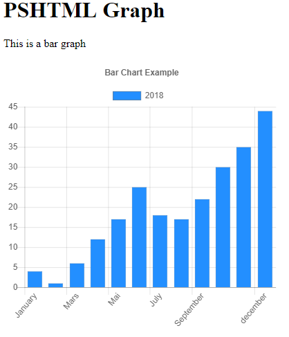

@snap[west span-50]
## PSHTML
@snapend

@snap[east span-50]
in 60 seconds
@snapend

---

## What is PSHTML?

---

# PSHTML

Is a Powershell module that allows you to script the generation of html documents using powershell like syntax. 

*It makes creating html pages really really easy!*

---

PSHTML is a PowerShell DSL (Domain Specific Language). 

It allows you to leverage your existing knowledge of powershell to create html documents without leaving your IDE. 

No more "html string building" as in 2015!

---

Create websites using *powershell* syntax __only__

---

```Powershell
Import-Module PSHTML

html {

    head{

        title "woop title"
        link "css/normalize.css" "stylesheet"
    }

    body{

        Header {
            h1 "This is h1 Title in header"
            div {
                p {
                    "This is simply a paragraph in a div."
                }
            }
        }


            p {
                h1 "This is h1"
                h2 "This is h2"
                h3 "This is h3"
                h4 "This is h4"
                h5 "This is h5"
                h6 "This is h6"
                strong "plop";"Woop"
            }
    }

}
```
---

Use all the techniques you already know.

* Loops (foreach, while, do while, for)
* Conditional statement (if elseIf() /Else, switch etc...)
* Functions, filters, classes

---

Use all the modules that you have learned to love over time

* ActiveDirectory
* ConfigMgr
* FailoverClustering
* PsClassUtils

---

Create Forms

```powershell
p{
    Form -action "CallThisPage.Html" -method get -target _self -Content{
        "Please input your password"
        input -type password "woop"
        "Please Confirm your passwor"
        input -type password -name "woop2"
    }
}
```

---


Create Tables manually

```powershell
---?gist=Stephanevg/14ac3948bf302bbcfef59dd20dd47a65&lang=powershell
```

---

Or generate tables dynamically

```powershell
$Process = Get-Process | select -First 3 
$Process | ConvertTo-PSHTMLTable -Properties "Name","Handles"
```

---

Create Drop down boxes

```powershell
p {
    "My favorite car is:"
}
SelectTag {
    option -value "Citroen" -Content "Citroen"
    option -value "Renault" -Content "Renault"
    option -value "Peugeot" -Content "Peugeot"
    option -value "DS" -Content "DS"
}
```

---

Or generate your drop down boxes 'dynamicaly'

```powershell
$Languages = @("PowerShell","Ruby","CSharp","Python")
p {
    "My favorite language is:"
}
SelectTag {
    foreach($language in $Languages){
        option -value $language -Content $language
    }
}
```

---

The header / footer of your page is always identical?

Use `includes` to include code in specific places

```powershell
html{
    include -Name head

    Body{

        include -name Body
        
        $PrimaryColors = @("Red","green","blue")

        H3 "Primary color are:"
        ul {
     
            Foreach($PColor in $PrimaryColors){
                
                li $PColor
            }
        }
        p {
            "This is just content after the unorded list but before the footer."
        }
    }
    
    Include -Name Footer
}
```

---


* [Get the code](https://github.com/Stephanevg/PSHTML/blob/master/PSHTML/Examples/Example6/Example6.ps1)


---

Out of the box support for assets such as

* BootStrap
* ChartJs
* Query

---
Create beautifull graphs in seconds using 

---

```powershell
#Preparing data
$Data3 = @(4,1,6,12,17,25,18,17,22,30,35,44)
$Labels = @("January","February","Mars","April","Mai","June","July","August","September","October","November","december")

#Creating a DataSet
$dsb3 = New-PSHTMLChartBarDataSet -Data $data3 -label "2018" -BackgroundColor ([Color]::blue )

#Generating the chart
New-PSHTMLChart -type bar -DataSet $dsb3 -title "Bar Chart Example" -Labels $Labels -CanvasID $BarCanvasID

```

---

Add your HTML / CSS knowledge directly in your PSHTML code.

---

Every cmdlet comes with:

* `-Class` -> Add classes to you html tags
* `-Style` -> Add inline styles to your html tags
* `-Attributes` -> Add custom attributes with values to your html tags.

---

Example

```powershell
p -Class "My Class" -Style "color:blue;margin-left:30px;" {
    "This is simply a paragraph in a div."
} -Attributes @{"MyCustomAttribute"="My custom value"}
```

Generates

```html
<p Style="color:blue;margin-left:30px;" Class="My Class" MyCustomAttribute="My custom value"  >
  This is simply a paragraph in a div.
</p>
```
---

Or benefit of abastractions, and focus only on your Powershell knowledge using cmdlets such as `ConvertTo-PSHTMLTable`.


