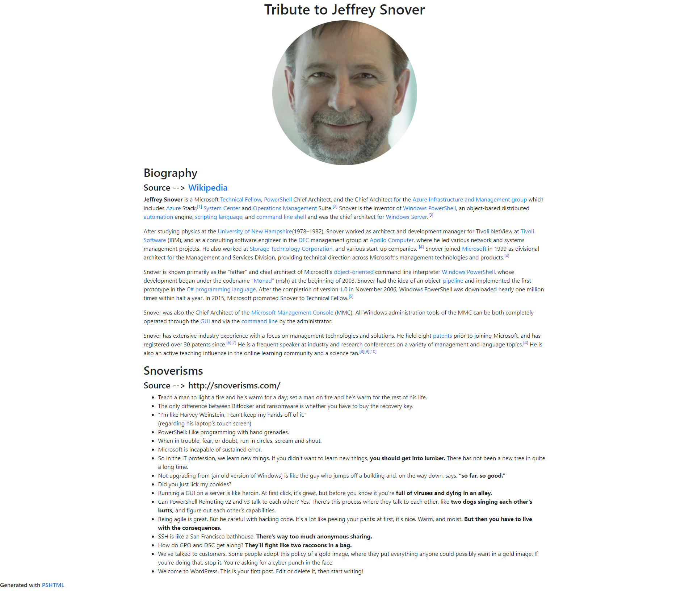
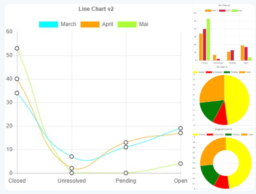

PSHTML is a cross platform Powershell module to generate HTML markup language within a DSL on Windows and Linux.

# Summary

`PSHTML` allow people to write a HTML document(s) using `powershell-like` syntax, which makes building webpages easier, and less cumbersome for 'native' PowerSheller's.

`PSHTML` offers the flexibility of the PowerShell language, and allows to add logic in ```powershell``` directly in the ```HTML``` structure. This open the possibility to add loops, conditional statements, switches, functions, classes, calling external modules etc.. all that directly from the same editor.

`PSHTML` comes with template functionality which allows one to `include` parts of webpages that are identical throughout the web page Eg: footer, Header,Menu etc..


Using PSHTML, offers code completion and syntax highlighting from the the default powershell language. As PSHTML respects the W3C standards, any HTML errors, will be spotted immediately.

Since version `0.7.0` PSHTML supports the creation of charts.

 
-----

## Status

|master|dev|docs|Downloads
|---|---|---|---|
[](https://ci.appveyor.com/project/Stephanevg/pshtml/branch/master) | [](https://ci.appveyor.com/project/Stephanevg/pshtml/branch/dev) | [](https://pshtml.readthedocs.io/en/latest/?badge=latest) | [](https://www.powershellgallery.com/packages/PSHTML/) |


A change log is available [here](Change_Log.md)
Known issues are tracked [here](Known_Issues.md)

## A few Basic examples of what PSHTML can achieve

### Basic page

The following quick example displays a simple page, with a few headers, divs, paragraphs, and header elements

```Powershell

Import-Module PSHTML

html {

    head{

        title "woop title"
        link "css/normalize.css" "stylesheet"
    }

    body{

        
        h1 "This is h1 Title in header"
        div {
            p {
                "This is simply a paragraph in a div."
            }

            h1 "This is h1"
            h2 "This is h2"
            h3 "This is h3"
            h4 "This is h4"
            h5 "This is h5"
            h6 "This is h6"
            strong "plop";"Woop"
        }
        

        h1 "My favorites Fruits"

        $Fruits = "Apple","Banana","Orange","Ananas"

        ul {

            foreach($fruit in $Fruits){
                li {
                    $fruit
                }
            }
        }

    }
    footer {
        p{
            "Copyright 2019"
        }
    }

}

```

## A more advanced example:

The following example is a tribute to PowerShell GodFather 'Jeffrey Snover' where we generated a BIO of the ShellFather gathering data from Wikipedia and other sources, all that using Powershell.




The example ```PSHTML / Powershell``` code is available [here](PSHTML/Examples/Example6/Example6.ps1)

The generated ```HTML``` code is available [here](PSHTML/Examples/Example6/Example6.html)


## Charts

Since version 0.7.0 PSHTML also supports the creation of beautifull charts.



Read more about charts and how easy it is to create them using PSHTML [here](https://pshtml.readthedocs.io/en/latest/Charts/Charts/).

## Documentation

Check out the [Documentation](https://pshtml.readthedocs.io/en/latest/) on how to use PSHTML.

## Check out references / mentions of PSHTML around the web 

The community is actively using PSHTML. Check out what people are saying about it, and how they use PSHTML to implement business solutions.
There might be a case answering your specific need?

- Introducing PSHTML on [PowershellDistrict](http://powershelldistrict.com/introducing-pshtml/).
- [Multiple Blog posts](https://chen.about-powershell.com/) from [@ChendrayanV](https://twitter.com/ChendrayanV).
- Presentation at [Glasgow Super Meetup](https://youtu.be/QS_gppC5UWQ?t=6246) by [@anthonyroud](https://twitter.com/anthonyroud).
- Powershell Conference Asia - [Presentation from Ravikanti Cheganti on how to build your own API](https://livestream.com/gaelcolas/PSConfAsia/videos/182130806) (Using Polaris and PSHTML). ( for the PSHTML example, check around 32min of the video.)

> Have you used PSHTML at work to deliver an awesome project ? Please share with us your experience ([Contact me](https://twitter.com/stephanevg) to discuss this.)

## See how community members use PSHTML

Find here a few examples where people already used PSHTML in various awesome ways.

- [Blog post](http://chen.about-powershell.com/2018/12/experiment-using-pshtml-in-node-js-and-host-a-azure-web-app/) about hosting a website on an Azure webApp using PSHTML and NodeJS. Thanks [@ChendrayanV](https://twitter.com/ChendrayanV)!
- Blog post demonstrating how to [autorefresh pages with Polaris and PSHTML](https://chen.about-powershell.com/2018/10/auto-refresh-polaris-page-to-retrieve-status-using-pshtml/). Thanks [@ChendrayanV](https://twitter.com/ChendrayanV)!
- [Docker Image](https://hub.docker.com/r/stijnc/eleu2018k8sweb) with Polaris and PSHTML. Thanks [@StijnCa](https://twitter.com/StijnCa).
- [Build your own API](https://livestream.com/accounts/26955461/PSConfAsia/videos/182130806) Presentation by [@ravikanth](https://twitter.com/ravikanth) at PSConfAsia. The PSHTML part starts at 31 minutes, however it is worth to watch the whole video.

## Contribute

Are you interested in contributing to the PSHTML project? 
Read our contribution guide [Here](CONTRIBUTING.md).

