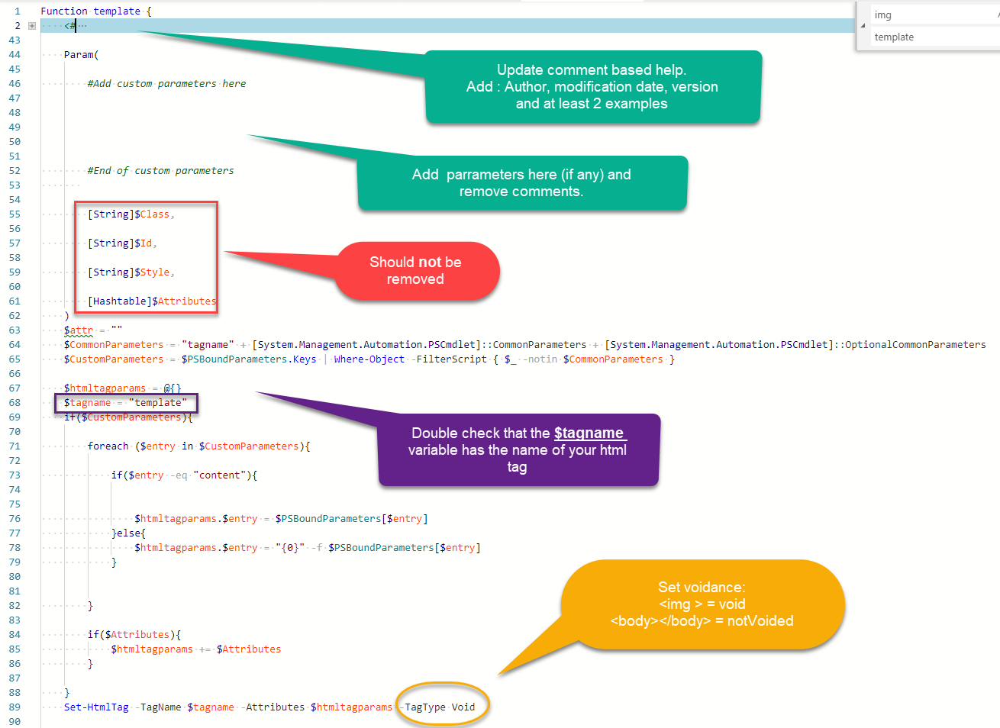
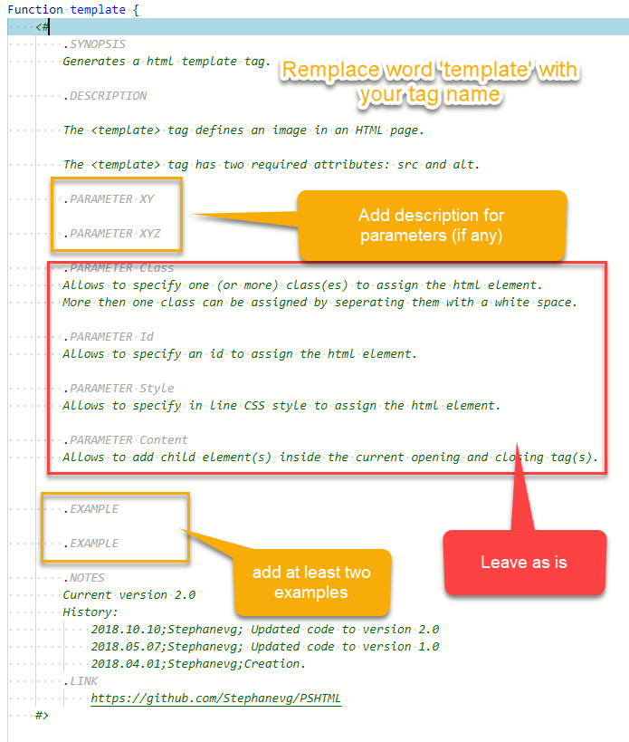

## Tag migration

I have written a new cmdlet named `Set-HTMLTag` which should be used as a base function to generate html tags.

In order to gain time, we can simply use the code from [This template](./Tag_Template.ps1).

Follow these simple steps to add the tag:

# function

# Comment based help

