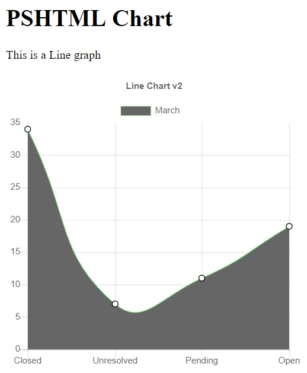

# Line charts

> Before reading this documentation, it is recommended to read the general chart documentation first [here](./Charts.md).

This page will highlight the steps to follow to create **Line** charts in  ```PSHTML```

# Creating a simple Line chart

A simple Line chart, is nothing more then a Linechart with a ```Dataset``` of type ```DatasetLine```

> As a reminder, a dataset is what will allow to specify the looks of the graph. Things like the color, hover over color, thickness etc.. are all set via a dataset. Each chart type comes with a set of specific dataset properties (for example, how big should the emtpy space in a Line graph be - is an options that cannot apply to a line chart).

In order to create a Linechart, we need to follow these steps:
0. Preparing a spot, for your chart, and linking to the library.
1. Create a datasetLine
2. Create a chart
3. Add the dataset to the chart
4. Display the chart

> In reality, step **1 & 2** and **3 & 4** are combined into comon steps represented in two different cmdlets .


## Preparing a spot for your chart 

A chart **will** find place on a [canvas](https://www.w3schools.com/tags/tag_canvas.asp) somewhere in your HTML page. 
Add your ```canvas``` somewhere in your ```body``` section of your page, like this:

```powershell
$LineCanvasID = "Linecanvas001"
canvas -Height 400px -Width 400px -Id $LineCanvasID {
    
}
```

> It is a good idea to set the __id__ of the canvas in a variable, as it will be needed in a later step to indicate to the chart where it should be created.

## Linking to the Chart Library

For the moment, one must add the following **Script section** at the end of the body section to ensure that the charting functionality can be used.

```powershell
script -src "https://cdnjs.cloudflare.com/ajax/libs/Chart.js/2.7.3/Chart.min.js" -type "text/javascript"
```

## Creating a dataset

The first step in creating a Chart is the creation of a Dataset.

Use the function ```New-PSHTMLChartLineDataSet``` to save the dataset in a variable as in this example:

```powershell
    $Data = @(34,7,11,19) #Get your data using any type of powershell cmdlet / function
    $dataset = New-PSHTMLChartLineDataSet -Data $Data -label "March" -BackgroundColor ([Color]::Orange)

```

> The ```$Data``` variable would contais integers, which would represents 'some' data over time for example.

### Creating and assigning the chart


Once the data set is created, a chart needs to be created, and the dataset added to this latter one.

In order to create a chart in ```PSHTML``` use the following cmdlet:

```powershell
New-PSHTMLChart
```

> The ```New-PSHTMLChart```cmdlet is your only entry point needed in order create charts. For the Line, set the **-Type** parameter value to **Line**.

```powershell
$Labels = @("Closed","Unresolved","Pending","Open") #description of each row from data
New-PSHTMLChart -Type Line -DataSet $Dataset -Title "March Data" -Labels $Labels -CanvasID $LineCanvasID
```

To recall, this was the data we provided:

```powershell
$Data = @(34,7,11,19)
$Labels = @("Closed","Unresolved","Pending","Open")


```

Which represents data from a ticketing system:

|Closed|Unresolved|Pending|open|
|---|---|---|---|
|34|7|11|19|

This would result in the following graph:



> Nota: The function must be called within a '-content' block of a 'script' section (See script listing below)

The full script listing is availble here under:

```powershell


import-module PSHTML -force

$LineCanvasID = "Linecanvas"
$HTMLPage = html { 
    head {
        title 'Chart JS Demonstration'
        
    }
    body {
        
        h1 "PSHTML Chart"

        div {
            

            p {
                "This is a Line graph"
            }
            canvas -Height 400px -Width 400px -Id $LineCanvasID {
    
            }
       }

         script -src "https://cdnjs.cloudflare.com/ajax/libs/Chart.js/2.7.3/Chart.min.js" -type "text/javascript"


        script -content {

            $Data1 = @(34,7,11,19)


            $colors = @("LightGreen","Red","LightBlue","LightYellow")
            $dsd1 = New-PSHTMLChartLineDataSet -Data $data1 -label "March" -backgroundcolor $colors -hoverbackgroundColor $Colors

            New-PSHTMLChart -type Line -DataSet @($dsd1) -title "Line Chart v2" -Labels $Labels -CanvasID $LineCanvasID
 
            
        }

         
    }
}


$OutPath = "$Home\BasicLineChart.html"
$HTMLPage | out-file -FilePath $OutPath -Encoding utf8
start $outpath

```
