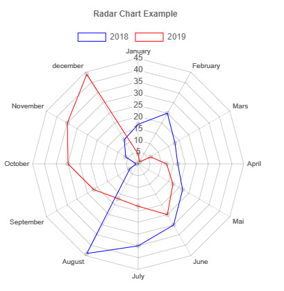

# Radar chart



## Dataset

```powershell

$Labels = @("January","February","Mars","April","Mai","June","July","August","September","October","November","december")

$dsb1 = @()
$Data1 = @(17,25,18,17,22,30,35,44,4,1,6,12)
$Data2 = @(4,1,6,12,17,25,18,17,22,30,35,44)

$dsb1 += New-PSHTMLChartBarDataSet -Data $data1 -label "2018" -borderColor (get-pshtmlColor -color blue) -backgroundColor "transparent" -hoverBackgroundColor (get-pshtmlColor -color green)
$dsb1 += New-PSHTMLChartBarDataSet -Data $data2 -label "2019" -borderColor (get-pshtmlColor -color red) -backgroundColor "transparent" -hoverBackgroundColor (get-pshtmlColor -color yellow)

```

> Use `Get-PSHTMLColor -Color` and tab through the results 

## Creating a chart

```powershell

New-PSHTMLChart -type radar -DataSet $dsb1 -title "Radar Chart Example" -Labels $Labels -CanvasID $radarCanvasID

```

## Combining everything together

```powershell

import-module PSHTML


$radarCanvasID = "radarcanvas"
$HTMLDocument = html { 
    head {
        title 'Chart JS Demonstration'
        
    }
    body {
        
        h1 "PSHTML Graph"

        div {
            
            p {
                "This is a radar graph"
            }
            canvas -Height 400px -Width 400px -Id $radarCanvasID {
    
            }

        }

        script -src "https://cdnjs.cloudflare.com/ajax/libs/Chart.js/2.7.3/Chart.min.js" -type "text/javascript"

        script -content {

            $Labels = @("January","February","Mars","April","Mai","June","July","August","September","October","November","december")
            $dsb1 = @() 

            $Data1 = @(17,25,18,17,22,30,35,44,4,1,6,12)
            $dsb1 += New-PSHTMLChartBarDataSet -Data $data1 -label "2018" -borderColor (get-pshtmlColor -color blue) -backgroundColor "transparent" -hoverBackgroundColor (get-pshtmlColor -color green)
            $Data2 = @(4,1,6,12,17,25,18,17,22,30,35,44)
            $dsb1 += New-PSHTMLChartBarDataSet -Data $data2 -label "2019" -borderColor (get-pshtmlColor -color red) -backgroundColor "transparent" -hoverBackgroundColor (get-pshtmlColor -color yellow)

            New-PSHTMLChart -type radar -DataSet $dsb1 -title "Radar Chart Example" -Labels $Labels -CanvasID $radarCanvasID

        }

            
    }
}


$OutPath = "$Home/RadarChart1.html"
Out-PSHTMLDocument -HTMLDocument $HTMLDocument -OutPath $OutPath -Show


```