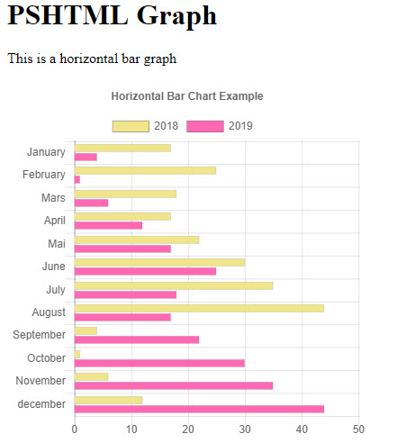

# Working with colors in PSHTML

When it comes to styling a html page, one can rarely do it without applying colors.
Charts colors are also highly customizable (hover color, backgroundcolor etc..)

In a HTML document, colors can be defined in different formats: `Hexidecimal, HSL,HSLA,RGB,RGBA`
each of them has it's own specificity. (Transparency, easy format etc..)

In version `0.8.0 ` of `PSHTML` we introduced a new function called `Get-PSHTMLColor`. This function allows to have an abstraction layer on the color model, and allows one to use simple color names to get the 'complex' color schemes back.
It allow one to simply `tab` throw the different colors available (on the `-color` Parameter), and select the appropriate color by name.

> The [140 official HTML color names and values](https://www.w3schools.com/colors/colors_names.asp) are available through `Get-PSHTMLColor`

Each time you need to apply some color somewhere in your HTML document, you can use the `-Color` parameter from the `Get-PSHTMLColor` simplify that process. 

> If not type parameter is specified, the `get-pshtmlcolor` will default to  `rgb`

# Example

Let's say you want to style something with the `Aliceblue` color

```Powershell

Get-PSHTMLColor -Type hex -Color aliceblue
#F0F8FF
```

Now, if you prefere to have the color in a `RGB` format, then you simply have to call `Get-pshtmlColor` like this

```Powershell

Get-PSHTMLColor -Type rgb -Color aliceblue
# returns
rgb(240,248,255)

```

# Applying a color to a chart

Charts can have colors applied to different parts of the chart: Backgroundcolor and HoverBackgroundColor are good examples.

> The colors below are reference as `chart` colors, but are in reality colors applied to the `dataset` of the charts.

```powershell

$dsb1 += New-PSHTMLChartBarDataSet -Data $data1 -label "2018" -BackgroundColor (get-pshtmlColor -color Khaki) -hoverBackgroundColor (get-pshtmlColor -color Salmon)
$Data2 = @(4,1,6,12,17,25,18,17,22,30,35,44)
$dsb1 += New-PSHTMLChartBarDataSet -Data $data2 -label "2019" -BackgroundColor (get-pshtmlColor -color HotPink) -hoverBackgroundColor (get-pshtmlColor -color LightPink)

New-PSHTMLChart -type horizontalBar -DataSet $dsb1 -title "Horizontal Bar Chart Example" -Labels $Labels -CanvasID $BarCanvasID

```


Running the above code, will return the following result:



The full code extract of the example is available here

```powershell

import-module PSHTML
$BarCanvasID = "barcanvas"
$htmlDocument = html { 
    head {
        title 'Chart JS Demonstration'
        
    }
    body {
        
        h1 "PSHTML Graph"

        div {
            
            p {
                "This is a horizontal bar graph"
            }
            canvas -Height 400px -Width 400px -Id $BarCanvasID {
    
            }

        }

        script -src "https://cdnjs.cloudflare.com/ajax/libs/Chart.js/2.7.3/Chart.min.js" -type "text/javascript"

        script -content {

            $Labels = @("January","February","Mars","April","Mai","June","July","August","September","October","November","december")
            $dsb1 = @() 

            $Data1 = @(17,25,18,17,22,30,35,44,4,1,6,12)

    $dsb1 += New-PSHTMLChartBarDataSet -Data $data1 -label "2018" -BackgroundColor (get-pshtmlColor -color Khaki) -hoverBackgroundColor (get-pshtmlColor -color Salmon)
    $Data2 = @(4,1,6,12,17,25,18,17,22,30,35,44)
    $dsb1 += New-PSHTMLChartBarDataSet -Data $data2 -label "2019" -BackgroundColor (get-pshtmlColor -color HotPink) -hoverBackgroundColor (get-pshtmlColor -color LightPink)

    New-PSHTMLChart -type horizontalBar -DataSet $dsb1 -title "Horizontal Bar Chart Example" -Labels $Labels -CanvasID $BarCanvasID

        }

            
    }
}


$OutPath = "$Home/BarChart2.html"
Out-PSHTMLDocument -HTMLDocument $htmlDocument -OutPath $outpath -Show

```